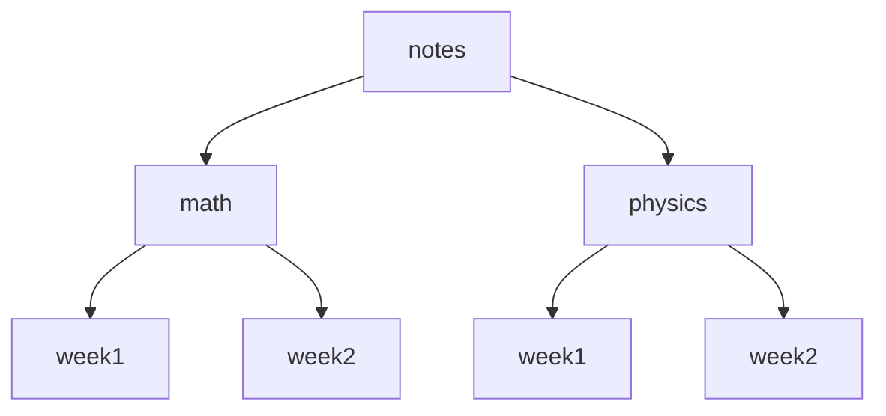

# File Archiving and Compression Commands

`Tags: Linux, Shell, archiving, compression, tar, zip`

| Field             | Value                                    |
| ----------------- | ----------------------------------------- |
| **Certificate**   | IBM Data Engineering Professional Certificate |
| **Course**        | C06 Hands-on Introduction to Linux Commands and Shell Scripting |
| **Module**        | M02 Introduction to Linux Commands        |
| **Lesson**        | L02 Working with Text files, Networking and Archiving Commands |
| **Date studied**  | 2026-08-25                                |

---

## Table of Contents

- [Overview](#overview)
- [Archiving vs. Compression](#archiving-vs-compression)
- [Example Directory Structure](#example-directory-structure)
- [Archiving and De-archiving with tar](#archiving-and-de-archiving-with-tar)
- [Compressing with tar and gzip](#compressing-with-tar-and-gzip)
- [Compressing and Extracting with zip and unzip](#compressing-and-extracting-with-zip-and-unzip)
- [Key Terms & Glossary](#-key-terms--glossary)
- [My Questions & Gaps](#-my-questions--gaps)
- [Resources](#-resources)

---

## Overview

วิดีโอนี้สอนความแตกต่างระหว่าง file archiving กับ file compression และคำสั่งที่ใช้ทำทั้งสองอย่าง ได้แก่ `tar` สำหรับ archive/de-archive (พร้อมตัวเลือก compress ด้วย gzip) และ `zip`/`unzip` สำหรับ compress/decompress พร้อม package ไฟล์เข้าด้วยกัน

---

## Archiving vs. Compression

Archiving และ compression เป็นกระบวนการที่แยกจากกัน แต่มักใช้ร่วมกัน

| กระบวนการ | ความหมาย | ประโยชน์ |
| --- | --- | --- |
| Archiving | รวมไฟล์และ directory หลายไฟล์เป็นไฟล์เดียว (archived file) เพื่อเก็บรักษาข้อมูลที่ไม่ได้ใช้บ่อย | ทำให้เคลื่อนย้ายง่ายขึ้น และเป็น backup กรณีข้อมูลสูญหายหรือเสียหาย |
| Compression | ลดขนาดไฟล์โดยอาศัย redundancy ในเนื้อหาไฟล์ | ประหยัดพื้นที่จัดเก็บ, โอนไฟล์เร็วขึ้น, ลด bandwidth |

---

## Example Directory Structure

วิดีโอใช้ตัวอย่าง directory ชื่อ `notes` ที่มี subfolder `math` และ `physics` แต่ละอันมีไฟล์ `week1` และ `week2` ซึ่งใช้ตัวอย่างนี้ตลอดวิดีโอเพื่อสาธิตคำสั่ง archive/compress



```bash
# แสดงไฟล์และ directory ทั้งหมดแบบ recursive ใน current directory tree
ls -R
```

---

## Archiving and De-archiving with tar

`tar` ("tape archiver") ใช้ archive และ de-archive ไฟล์/directory ไฟล์ที่ archive แล้วมักเรียกว่า "tar ball"

| Option | ความหมาย |
| --- | --- |
| `-c` | สร้าง archive ใหม่ (create) |
| `-f` | ระบุว่า input/output เป็นไฟล์ (แทน default ที่เป็น standard input) |
| `-x` | แตกไฟล์และ directory ออกจาก archive (extract) |
| `-t` | แสดงรายการไฟล์ใน archive (list) |

```bash
# archive directory notes เป็นไฟล์ notes.tar
tar -cf notes.tar notes

# แสดงรายการไฟล์ทั้งหมดใน tar ball
tar -tf notes.tar

# de-archive (extract) notes.tar กลับไปเป็นไฟล์และ directory เดิม
tar -xf notes.tar notes
```

---

## Compressing with tar and gzip

การเพิ่ม option `-z` ให้กับ `tar` จะ filter archive ผ่านโปรแกรม compression ชื่อ gzip โดยจะตั้งชื่อไฟล์ด้วย suffix `.tar.gz` เพื่อให้โปรแกรมบน Windows จดจำชนิดไฟล์ได้ถูกต้อง `tar -z` จะ compress หลังจาก bundle ไฟล์เป็น tar ball แล้วเท่านั้น (ต่างจาก `zip` ที่ compress ก่อน bundle)

```bash
# archive และ compress directory notes เป็น notes.tar.gz
tar -czf notes.tar.gz notes

# แตกไฟล์และ decompress notes.tar.gz กลับไปเป็นไฟล์และ directory เดิม
tar -xzf notes.tar.gz notes
```

---

## Compressing and Extracting with zip and unzip

`zip` compress ไฟล์และ directory แล้ว package รวมเป็น archive เดียว โดย compress ไฟล์ **ก่อน** bundle เข้าด้วยกัน ต่างจาก `tar -z` ที่ compress **หลัง** bundle `unzip` ใช้แตกไฟล์และ decompress ไฟล์ zip กลับมา

```bash
# compress และ package directory notes เป็น notes.zip (-r สำหรับ recursive)
zip -r notes.zip notes

# แตกไฟล์และ decompress notes.zip กลับไปเป็นไฟล์และ directory เดิม
unzip notes.zip
```

---

## 📖 Key Terms & Glossary

| Term (ศัพท์) | คำอธิบาย (ภาษาไทย) |
| ------------- | -------------------- |
| Archiving | กระบวนการรวมไฟล์และ directory หลายไฟล์เป็นไฟล์เดียวเพื่อเก็บรักษาและสำรองข้อมูล |
| Compression | กระบวนการลดขนาดไฟล์โดยอาศัย redundancy ในเนื้อหาไฟล์ |
| tar ball | ชื่อเรียกทั่วไปของไฟล์ที่ถูก archive ด้วยคำสั่ง tar |
| tar | คำสั่ง archive/de-archive ไฟล์และ directory (tape archiver) รองรับการ compress ด้วย gzip ผ่าน option `-z` |
| gzip | โปรแกรม compression ที่ `tar -z` ใช้ในการ filter/compress archive |
| zip | คำสั่ง compress ไฟล์และ directory แล้ว package รวมเป็น archive เดียว compress ก่อน bundle |
| unzip | คำสั่งแตกไฟล์และ decompress ไฟล์ zip archive |

---

## ❓ My Questions & Gaps

- [x] เหตุใดลำดับ compress-then-bundle ของ `zip` กับ bundle-then-compress ของ `tar -z` จึงให้ผลลัพธ์ขนาดไฟล์ต่างกัน ตัวไหนมักได้ไฟล์เล็กกว่าโดยทั่วไป
  - **คำตอบ:** `tar -z` (bundle-then-compress) มักได้ไฟล์เล็กกว่า เพราะ compression algorithm อย่าง gzip ทำงานได้ดีขึ้นเมื่อมีข้อมูลต่อเนื่องขนาดใหญ่ให้หา redundancy/pattern ร่วมกันข้ามทั้งไฟล์ ในขณะที่ `zip` compress ไฟล์แต่ละไฟล์แยกกันก่อน bundle จึงหา pattern ซ้ำข้ามไฟล์ไม่ได้ ทำให้โดยรวมได้ compression ratio ที่ด้อยกว่าเมื่อไฟล์มีเนื้อหาคล้ายกันหลายไฟล์ อย่างไรก็ตาม `zip` มีข้อดีคือแตกไฟล์เดียวจาก archive ได้โดยไม่ต้อง decompress ทั้งก้อน เพราะแต่ละไฟล์ compress แยกกัน
- [x] มี compression algorithm อื่นนอกจาก gzip ที่ใช้ร่วมกับ `tar` ได้อีกหรือไม่ (เช่น bzip2, xz)
  - **คำตอบ:** มี `tar` รองรับ compression algorithm อื่นผ่าน option เพิ่มเติมนอกจาก `-z` (gzip) เช่น `-j` สำหรับ bzip2 (compression ratio สูงกว่า gzip แต่ช้ากว่า) และ `-J` สำหรับ xz (compression ratio สูงที่สุดในกลุ่มนี้แต่ใช้เวลาและ CPU มากที่สุด) การเลือกใช้ตัวไหนจึงเป็นการ trade-off ระหว่างความเร็วในการ compress/decompress กับขนาดไฟล์ผลลัพธ์ที่ต้องการ

---

## 🔗 Resources

- ไม่มีลิงก์หรือเอกสารอ้างอิงเพิ่มเติมในวิดีโอนี้
