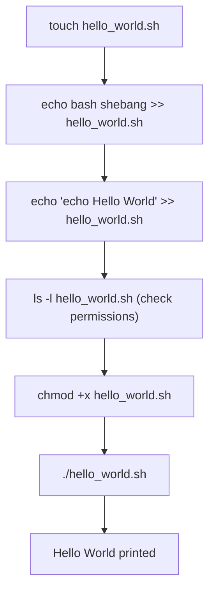

# Shell Scripting Basics

`Tags: shell scripting, bash, shebang, Linux`

| Field             | Value                                    |
| ----------------- | ----------------------------------------- |
| **Certificate**   | IBM Data Engineering Professional Certificate |
| **Course**        | C06 Hands-on Introduction to Linux Commands and Shell Scripting |
| **Module**        | M03 Shell Scripting                       |
| **Lesson**        | L01 Shell Scripting Basics                |
| **Date studied**  | 2026-08-27                                |

---

## Table of Contents

- [Overview](#overview)
- [What is a Script](#what-is-a-script)
- [Use Cases for Scripting](#use-cases-for-scripting)
- [The Shebang Interpreter Directive](#the-shebang-interpreter-directive)
- [Creating and Running a Hello World Script](#creating-and-running-a-hello-world-script)
- [Key Terms & Glossary](#key-terms--glossary)
- [My Questions & Gaps](#my-questions--gaps)
- [Resources](#resources)

---

## Overview

วิดีโอนี้แนะนำแนวคิดพื้นฐานของ shell script ตั้งแต่ script คืออะไร ใช้ทำอะไรได้บ้าง ไปจนถึงการสร้างและรันไฟล์ shell script ตัวแรกด้วยตัวอย่าง 'hello world' เนื้อหาครอบคลุมความแตกต่างระหว่าง scripting language กับ compiled language และองค์ประกอบของ 'shebang' directive ที่บอกระบบว่าจะใช้โปรแกรมใดในการตีความไฟล์นั้น

---

## What is a Script

Script คือชุดคำสั่งที่ถูกตีความและรันโดยโปรแกรมที่เรียกว่า scripting language คำสั่งสามารถพิมพ์ทีละบรรทัดที่ command line โดยตรง หรือเขียนเรียงกันไว้ในไฟล์ text ก็ได้ scripting language ส่วนใหญ่ไม่ถูก compile แต่จะถูก interpret ตอน runtime ทำให้ script โดยทั่วไปรันช้ากว่า compiled language แต่แลกมากับความง่ายและความเร็วในการพัฒนา

---

## Use Cases for Scripting

Script ถูกใช้อย่างแพร่หลายในการ automate กระบวนการต่าง ๆ เช่น

- ETL job
- การสำรองไฟล์ (file backup) และการเก็บถาวร (archiving)
- งาน system administration ทั่วไป
- Application integration
- การพัฒนา plug-in และ web application

---

## The Shebang Interpreter Directive

Shell script คือไฟล์ text ที่ executable ได้ โดยบรรทัดแรกมักจะเป็น interpreter directive หรือที่เรียกว่า 'shebang' directive มีรูปแบบคือ pound-bang-interpreter บวก argument ที่เป็น optional (`#!interpreter [optional-argument]`) โดย interpreter คือ absolute path ไปยังโปรแกรม executable ที่จะใช้ตีความไฟล์นั้น

Shell script คือ script ที่เรียก shell program ตัวอย่าง shebang ที่พบบ่อย:

| Shebang | ความหมาย |
| --- | --- |
| `#!/bin/sh` | เรียก Bourne shell หรือ shell ที่เข้ากันได้ จาก bin directory |
| `#!/bin/bash` | เรียก Bash shell |
| `#!/usr/bin/env python3` | shebang ไม่ได้จำกัดแค่ shell program เท่านั้น ยังใช้เรียก interpreter อื่นได้ เช่น Python |

---

## Creating and Running a Hello World Script

ขั้นตอนสร้างและรัน shell script ตัวอย่าง 'hello world':



```bash
# create an empty file named hello_world.sh
touch hello_world.sh

# append the bash shebang line to the file
echo "#!/bin/bash" >> hello_world.sh

# append the command that prints Hello World
echo "echo Hello World" >> hello_world.sh

# check current permissions (r, w, but not x)
ls -l hello_world.sh
-rw-rw-r-- 1 user user 30 Aug 27 10:00 hello_world.sh

# make the script executable for all users
chmod +x hello_world.sh

# check permissions again - x now appears for owner, group, and others
ls -l hello_world.sh
-rwxrwxr-x 1 user user 30 Aug 27 10:00 hello_world.sh

# run the script
./hello_world.sh
Hello World
```

การ `ls -l` แสดงสิทธิ์ readable (R) และ writable (W) แต่ยังไม่มี executable (X) ซึ่งสิทธิ์ R, W, X นี้ครอบคลุม 3 กลุ่มผู้ใช้ คือ owner (เจ้าของไฟล์), group, และ all users หลังจากใช้ `chmod +x` จะเห็น X ปรากฏครบทั้ง 3 กลุ่ม ทำให้ script รันได้ด้วยคำสั่ง `./hello_world.sh`

---

## 📖 Key Terms & Glossary

| Term (ศัพท์) | คำอธิบาย (ภาษาไทย) |
| ------------- | -------------------- |
| Scripting language | ภาษาที่ใช้เขียน script ปกติไม่ถูก compile แต่ถูก interpret ตอน runtime |
| Compiled language | ภาษาที่ต้อง compile ก่อนรัน โดยทั่วไปรันเร็วกว่า scripting language แต่ใช้เวลาพัฒนานานกว่า |
| Interpreted | ลักษณะของ scripting language ที่ถูกแปลและรันทันทีตอน runtime โดยไม่ต้อง compile ล่วงหน้า |
| Shebang | interpreter directive ที่วางอยู่บรรทัดแรกของ shell script มีรูปแบบ `#!interpreter [argument]` ใช้บอกระบบว่าจะใช้โปรแกรมใดตีความไฟล์นี้ |
| Interpreter directive | ชื่อเรียกอีกอย่างของ shebang directive |
| `.sh` extension | นามสกุลไฟล์ที่เป็นข้อตกลง (convention) ใช้บ่งบอกว่าไฟล์นั้นเป็น shell script |
| Output redirection (`>>`) | operator ของ Bash ใช้ append ผลลัพธ์ต่อท้ายไฟล์ |
| chmod +x | คำสั่งเปลี่ยนสิทธิ์ของไฟล์ให้ executable ได้ |

---

## ❓ My Questions & Gaps

- [x] ความแตกต่างระหว่าง `chmod +x` กับการระบุสิทธิ์แบบตัวเลข (เช่น `chmod 755`) คืออะไร และควรใช้แบบไหนเมื่อไหร่
  - **คำตอบ:** `chmod +x` เป็นการ "เพิ่ม" สิทธิ์ executable แบบสัมพัทธ์ (relative) ให้กับสิทธิ์เดิมที่มีอยู่ โดยไม่ยุ่งกับสิทธิ์ read/write ที่ตั้งไว้แล้ว เหมาะกับกรณีที่แค่ต้องการเปิดสิทธิ์รันไฟล์เพิ่มโดยไม่สนใจสิทธิ์อื่น ส่วน `chmod 755` เป็นการกำหนดสิทธิ์แบบตัวเลข (absolute) ซึ่งจะ "เซ็ตทับ" สิทธิ์ทั้งหมดของ owner/group/others ในครั้งเดียว (เช่น 755 = owner อ่าน-เขียน-รัน, group และ others อ่าน-รันได้อย่างเดียว) เหมาะกับกรณีที่ต้องการควบคุมสิทธิ์ทั้ง 3 กลุ่มให้ชัดเจนแม่นยำ หรือตั้งสิทธิ์ตั้งแต่ต้นโดยไม่สนใจค่าที่มีอยู่เดิม
- [x] ถ้า shebang ระบุ interpreter ผิด path (เช่นเครื่องไม่มี `/bin/bash`) จะเกิด error แบบไหน และแก้ไขอย่างไร
  - **คำตอบ:** เมื่อรัน script ระบบจะพยายามหา interpreter ตาม absolute path ที่ระบุใน shebang หากไม่พบไฟล์นั้นจริง จะได้ error ประมาณ `bad interpreter: No such file or directory` (หรือ shell รายงานว่า "command not found" เมื่อรันผ่าน `./script.sh`) วิธีแก้คือตรวจสอบ path ที่ถูกต้องของ interpreter ด้วยคำสั่ง `which bash` หรือ `type bash` แล้วแก้ไข path ใน shebang ให้ตรงกับตำแหน่งจริงในเครื่องนั้น หรือใช้ `#!/usr/bin/env bash` แทน เพื่อให้ระบบค้นหา interpreter จาก `PATH` แทนการ hardcode path ตายตัว

---

## 🔗 Resources

- ไม่มีลิงก์หรือเอกสารอ้างอิงเพิ่มเติมที่กล่าวถึงในวิดีโอนี้
