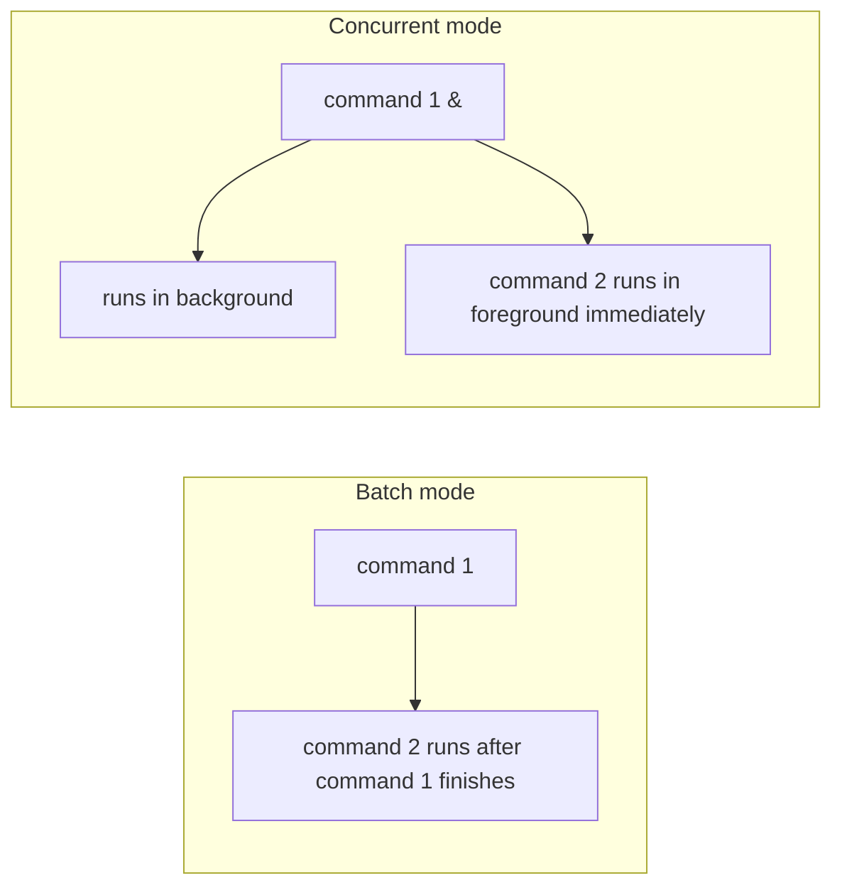

# Useful Features of the Bash Shell

`Tags: shell scripting, bash, metacharacters, quoting, redirection, Linux`

| Field             | Value                                    |
| ----------------- | ----------------------------------------- |
| **Certificate**   | IBM Data Engineering Professional Certificate |
| **Course**        | C06 Hands-on Introduction to Linux Commands and Shell Scripting |
| **Module**        | M03 Shell Scripting                       |
| **Lesson**        | L05 Useful Features of the Bash Shell     |
| **Date studied**  | 2026-08-27                                |

---

## Table of Contents

- [Overview](#overview)
- [Metacharacters](#metacharacters)
- [Quoting](#quoting)
- [Input/Output Redirection](#inputoutput-redirection)
- [Command Substitution](#command-substitution)
- [Command Line Arguments](#command-line-arguments)
- [Batch Mode vs Concurrent Mode](#batch-mode-vs-concurrent-mode)
- [Key Terms & Glossary](#key-terms--glossary)
- [My Questions & Gaps](#my-questions--gaps)
- [Resources](#resources)

---

## Overview

วิดีโอนี้แนะนำฟีเจอร์ที่มีประโยชน์ของ Bash shell ได้แก่ metacharacter (อักขระพิเศษที่ shell ตีความเป็นคำสั่ง), quoting (วิธีบอก shell ว่าจะตีความอักขระพิเศษหรือให้มองเป็น text ธรรมดา), I/O redirection (การเปลี่ยนทิศทางของ input/output), command substitution (การแทนที่คำสั่งด้วยผลลัพธ์ของมัน), command line argument, และความแตกต่างระหว่าง batch mode กับ concurrent mode

---

## Metacharacters

Metacharacter คืออักขระพิเศษที่มีความหมายเฉพาะต่อ shell

| Metacharacter | ความหมาย |
| --- | --- |
| `#` | ใช้แทน comment ที่ shell จะไม่สนใจ (ignore) |
| `;` | ตัวคั่นระหว่างคำสั่งที่พิมพ์อยู่ในบรรทัดเดียวกัน |
| `*` | แทนตัวอักษรจำนวนเท่าไหร่ก็ได้ (รวม 0 ตัว) ใน filename pattern |
| `?` | แทนตัวอักษรเพียง 1 ตัวใน filename pattern (เวอร์ชัน single-character ของ `*`) |

```bash
# comment: shell ignores everything after #, so this line does not return anything
# this is a comment

# semicolon separates two commands on the same line, output appears on two lines
echo "Hello,"; echo "world!"

# asterisk matches any object in /bin starting with "ba" followed by any characters
ls /bin/ba*

# question mark matches a single character, e.g. bash and dash paths
ls /bin/?ash
```

---

## Quoting

Quoting คือการระบุว่า shell ควรตีความอักขระพิเศษเป็น metacharacter หรือ 'escape' มัน (มองเป็น text ธรรมดา)

| วิธี Quoting | ความหมาย |
| --- | --- |
| Backslash `\` | escape การตีความของตัวอักษรตัวเดียวไม่ให้เป็น metacharacter |
| Double quotes `" "` | ตีความ text ตามตัวอักษร ยกเว้น metacharacter ที่ยังถูกตีความตามความหมายพิเศษ |
| Single quotes `' '` | ตีความทุกอย่างภายในเป็น literal ทั้งหมด ไม่มี metacharacter ใดถูกตีความพิเศษ |

```bash
# backslash tells Bash to treat $ as literal text, not a variable
echo \$1 each
$1 each

# without the backslash, $1 is interpreted as a variable (empty here), printing the space before "each"
echo "$1 each"
 each

# single quotes interpret everything literally, same result as the backslash example
echo '$1 each'
$1 each
```

---

## Input/Output Redirection

I/O redirection คือชุดฟีเจอร์ที่ใช้เปลี่ยนทิศทางของ standard input (keyboard) หรือ standard output (terminal)

| Symbol | ความหมาย |
| --- | --- |
| `>` | redirect standard output ไปยังไฟล์ สร้างไฟล์ใหม่ถ้ายังไม่มี และเขียนทับเนื้อหาเดิมถ้ามีอยู่แล้ว |
| `>>` | redirect standard output แบบ append ต่อท้ายไฟล์ ไม่เขียนทับเนื้อหาเดิม |
| `2>` | redirect error message ไปยังไฟล์ |
| `2>>` | redirect error message แบบ append ต่อท้ายไฟล์ |
| `<` | redirect เนื้อหาของไฟล์ให้เป็น standard input ของคำสั่ง |

```bash
# create a file and populate it with text at the same time
echo "line1" > eg.txt

# view the file's contents
cat eg.txt
line1

# append another line without overwriting existing content
echo "line2" >> eg.txt
cat eg.txt
line1
line2

# an invalid command produces an error message
garbage
garbage: command not found

# redirect (and append) the error message to a file instead of the terminal
garbage 2>> err.txt
cat err.txt
garbage: command not found
```

---

## Command Substitution

Command substitution ใช้แทนที่คำสั่งด้วย output ของมัน มี 2 รูปแบบที่เทียบเท่ากัน คือ `$(command)` และ backtick `` `command` ``

```bash
# capture the output of pwd into the variable "here"
here=$(pwd)

# echoing the variable returns the current directory path
echo $here
/home/user/project
```

---

## Command Line Arguments

Command line argument คือ argument ที่ระบุตอนเรียกใช้โปรแกรมบน command line ใช้สำหรับส่งค่าเข้าไปให้ shell script

```bash
# arg1 and arg2 are passed as command line arguments to MyBashScript.sh
./MyBashScript.sh arg1 arg2
```

---

## Batch Mode vs Concurrent Mode

Bash มี 2 โหมดหลักในการทำงาน



| โหมด | พฤติกรรม |
| --- | --- |
| Batch mode | โหมดปกติ รันคำสั่งตามลำดับ (sequential) เช่น `command1; command2` — command 2 จะรันก็ต่อเมื่อ command 1 เสร็จแล้วเท่านั้น |
| Concurrent mode | คำสั่งรันแบบขนาน (parallel) โดยใช้ ampersand `&` ต่อท้าย command 1 เพื่อสั่งให้รันใน background แล้วส่งควบคุมให้ command 2 รันใน foreground ทันที |

```bash
# batch mode: command2 runs only after command1 completes
command1; command2

# concurrent mode: command1 runs in the background, command2 runs immediately in the foreground
command1 & command2
```

---

## 📖 Key Terms & Glossary

| Term (ศัพท์) | คำอธิบาย (ภาษาไทย) |
| ------------- | -------------------- |
| Metacharacter | อักขระพิเศษที่มีความหมายเฉพาะต่อ shell เช่น `#`, `;`, `*`, `?` |
| Quoting | กลไกที่ใช้บอกว่า shell ควรตีความอักขระพิเศษเป็น metacharacter หรือ escape มันให้เป็น text ธรรมดา |
| I/O redirection | ชุดฟีเจอร์ที่ใช้เปลี่ยนทิศทางของ standard input หรือ standard output |
| Command substitution | การแทนที่คำสั่งด้วย output ของมัน โดยครอบด้วย `$()` หรือ backtick |
| Batch mode | โหมดการทำงานปกติของ Bash ที่รันคำสั่งตามลำดับ (sequential) |
| Concurrent mode | โหมดการทำงานของ Bash ที่รันคำสั่งแบบขนาน (parallel) โดยใช้ `&` |
| Ampersand (`&`) | operator ที่สั่งให้คำสั่งก่อนหน้ารันใน background |

---

## ❓ My Questions & Gaps

- [x] เมื่อรันคำสั่งด้วย `&` ใน concurrent mode แล้ว จะรู้ได้อย่างไรว่า background job เสร็จสิ้นแล้วหรือยัง
  - **คำตอบ:** สามารถใช้คำสั่ง `jobs` เพื่อดูสถานะของ background job ทั้งหมดใน shell session ปัจจุบัน หรือใช้คำสั่ง `wait` เพื่อให้ shell หยุดรอจนกว่า background job นั้นจะรันเสร็จก่อนจะทำงานต่อ นอกจากนี้เมื่อ background job เสร็จสิ้น shell มักจะแสดงข้อความแจ้ง (เช่น `[1]+  Done`) ก่อนแสดง prompt ครั้งถัดไปด้วย
- [x] ทำไมการใช้ double quotes กับ `$1` จึงได้ค่าว่าง (empty) แทนที่จะ error ทั้งที่ตัวแปร `$1` ยังไม่ได้ถูก assign
  - **คำตอบ:** ใน Bash การอ้างอิงตัวแปรที่ยังไม่ได้ถูก assign (รวมถึง positional parameter อย่าง `$1` ที่ไม่มี argument ส่งเข้ามา) จะไม่ทำให้เกิด error แต่ Bash จะขยาย (expand) ตัวแปรนั้นเป็น string ว่างแทน เพราะ Bash ไม่ได้บังคับให้ต้อง declare ตัวแปรก่อนใช้งานเหมือนภาษาที่ type-safe เมื่อ `$1` ถูกขยายเป็นค่าว่างภายใน double quotes จึงเหลือแค่ text ที่เหลือ (`" each"`) ให้ echo ออกมาเท่านั้น

---

## 🔗 Resources

- ไม่มีลิงก์หรือเอกสารอ้างอิงเพิ่มเติมที่กล่าวถึงในวิดีโอนี้
