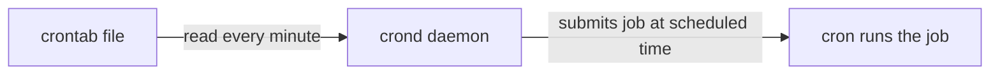

# Scheduling Jobs using Cron

`Tags: shell scripting, cron, crontab, scheduling, Linux`

| Field             | Value                                    |
| ----------------- | ----------------------------------------- |
| **Certificate**   | IBM Data Engineering Professional Certificate |
| **Course**        | C06 Hands-on Introduction to Linux Commands and Shell Scripting |
| **Module**        | M03 Shell Scripting                       |
| **Lesson**        | L08 Scheduling Jobs using Cron            |
| **Date studied**  | 2026-08-27                                |

---

## Table of Contents

- [Overview](#overview)
- [Cron, Crond, and Crontab](#cron-crond-and-crontab)
- [Cron Syntax](#cron-syntax)
- [Applying a Cron Job](#applying-a-cron-job)
- [Listing and Removing Cron Jobs](#listing-and-removing-cron-jobs)
- [Key Terms & Glossary](#key-terms--glossary)
- [My Questions & Gaps](#my-questions--gaps)
- [Resources](#resources)

---

## Overview

วิดีโอนี้แนะนำ cron utility บน Linux/Unix ที่ใช้สำหรับตั้งเวลาให้ job (เช่น shell command หรือ shell script) รันโดยอัตโนมัติตามเวลาที่กำหนด เนื้อหาครอบคลุมความแตกต่างระหว่าง cron, crond, และ crontab, รูปแบบ syntax ของ cron schedule, และวิธี apply หรือ remove cron job ผ่านคำสั่ง `crontab`

---

## Cron, Crond, and Crontab

| คำ | ความหมาย |
| --- | --- |
| Cron | ชื่อเรียกทั่วไปของเครื่องมือที่รัน scheduled job ซึ่งประกอบด้วย shell command หรือ shell script |
| Crond | daemon หรือ service ที่ตีความ "crontab file" ทุกนาที และส่ง job ที่ตรงกับเวลาที่กำหนดไปให้ cron รัน |
| Crontab | ชื่อย่อของ "cron table" คือไฟล์ที่เก็บ job และข้อมูล schedule นอกจากนี้ยังเป็นชื่อคำสั่งที่เรียก text editor เพื่อแก้ไข crontab file |



---

## Cron Syntax

การพิมพ์ `crontab -e` ที่ command line จะเปิด text editor ค่า default ขึ้นมาให้แก้ไข crontab file โดยรูปแบบ syntax ของแต่ละ cron job คือ:

```
minute hour day_of_month month day_of_week command
```

| ตำแหน่ง | ความหมาย |
| --- | --- |
| minute | นาที (0-59) |
| hour | ชั่วโมง (0-23) |
| day of month | วันที่ (1-31) |
| month | เดือน (1-12) |
| day of week | วันในสัปดาห์ (0-7, ทั้ง 0 และ 7 หมายถึงวันอาทิตย์) |
| command | คำสั่ง shell ใด ๆ รวมถึงการเรียก shell script |

ทั้ง 5 ตำแหน่งแรกต้องเป็นตัวเลข หรือใช้เครื่องหมาย asterisk (`*`) ซึ่งเป็น wildcard ที่หมายถึง "any" (ค่าใดก็ได้)

```bash
# append the current date to sundays.txt at 15:30 every Sunday
30 15 * * 0 date >> sundays.txt
```

---

## Applying a Cron Job

การพิมพ์ `crontab -e` จะเปิด default text editor (ในตัวอย่างคือ GNU nano) ซึ่งมีคำแนะนำสำหรับตั้งค่า cron job แสดงเป็น comment อยู่ในไฟล์อยู่แล้ว ระยะห่าง (space) ระหว่างแต่ละคอลัมน์จะถูก shell มองข้าม จึงสามารถจัดรูปแบบให้เรียงเป็นคอลัมน์ให้อ่านง่ายได้

```bash
# append the current date to sundays.txt at 15:30 every Sunday
30 15 * * 0 date >> sundays.txt

# run the load-data script at midnight every day
0 0 * * * /path/to/load-data.sh

# run the backup script at 2 AM every Sunday
0 2 * * 0 /path/to/backup.sh
```

หลังจากแก้ไขเสร็จ ให้กด `control x` เพื่อออกจาก editor แล้วพิมพ์ `y` เพื่อบันทึกการเปลี่ยนแปลง job ก็จะถูกเพิ่มเข้าไปใน production ทันที

---

## Listing and Removing Cron Jobs

```bash
# list all cron jobs and their schedules
crontab -l

# pipe the output to tail to avoid showing all the comments in the crontab file
crontab -l | tail
```

การรัน `crontab -l` จะแสดงรายการ cron job ทั้งหมดพร้อม schedule ของมัน สามารถ pipe ต่อไปยัง `tail` เพื่อข้าม comment ที่อยู่ด้านบนของไฟล์ได้

การลบ job ทำได้โดยเรียก `crontab -e` เพื่อเปิด editor แล้วลบบรรทัดของ job นั้นออก จากนั้นบันทึกการเปลี่ยนแปลง

---

## 📖 Key Terms & Glossary

| Term (ศัพท์) | คำอธิบาย (ภาษาไทย) |
| ------------- | -------------------- |
| Cron | ชื่อทั่วไปของเครื่องมือที่รัน scheduled job บน Linux/Unix ซึ่งประกอบด้วย shell command หรือ shell script |
| Crond | daemon ที่ตีความ crontab file ทุกนาทีและส่ง job ที่ตรงเวลาไปให้ cron รัน |
| Crontab | ไฟล์ที่เก็บ job และข้อมูล schedule (ย่อจาก cron table) และยังเป็นชื่อคำสั่งที่เปิด text editor เพื่อแก้ไขไฟล์นั้น |
| `crontab -e` | คำสั่งที่เปิด default text editor เพื่อแก้ไข crontab file |
| `crontab -l` | คำสั่งที่แสดงรายการ cron job ทั้งหมดพร้อม schedule ของมัน |
| Cron syntax | รูปแบบ 5 ฟิลด์ (minute, hour, day of month, month, day of week) บวก command ที่ใช้กำหนดตารางเวลาของ cron job |
| Wildcard (`*`, cron) | เครื่องหมายในแต่ละฟิลด์ของ cron syntax ที่หมายถึง "ค่าใดก็ได้" |

---

## ❓ My Questions & Gaps

- [ ] ถ้าเครื่องปิดหรือ restart อยู่ในช่วงเวลาที่ cron job ควรจะรัน job นั้นจะถูกข้ามไปเลยหรือถูก catch up ทีหลัง
- [ ] สามารถตั้งค่าให้ cron ส่ง notification (เช่น email) เมื่อ job รันสำเร็จหรือ error ได้หรือไม่ ต้องตั้งค่าอย่างไร

---

## 🔗 Resources

- ไม่มีลิงก์หรือเอกสารอ้างอิงเพิ่มเติมที่กล่าวถึงในวิดีโอนี้
